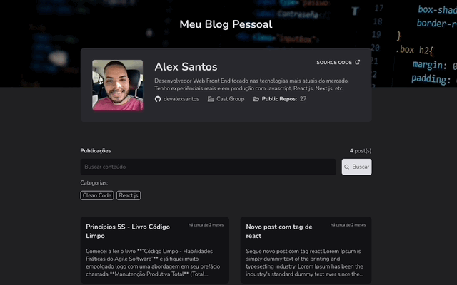
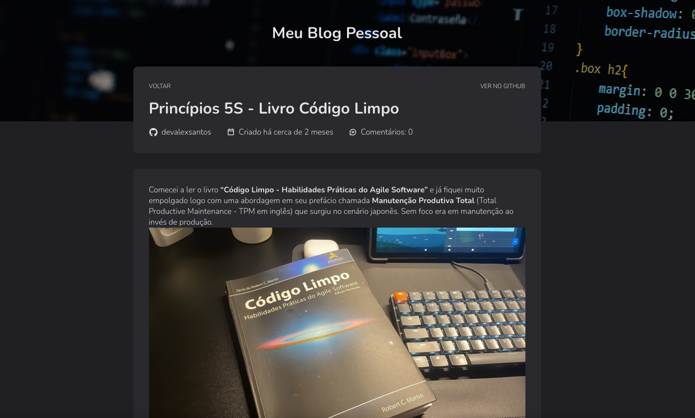

<h1 align="center">Blog Pessoal - Alex Santos</h1>

Criação de uma aplicação de Blog Pessoal para publicação de artigos utilizando as Issues do Github via API. Usei como categoria as tags das issues e as próprias issues como artigos.

  <h3> 🚀 Publicado 🚀 </h3>
  <strong><a href="https://blog-devalexsantos.vercel.app/" target="_blank">🔗 Visualize o projeto clicando aqui</a></strong>

# Sumário
-[Funcionalidades](#funcionalidades)  
-[Imagens](#imagens) 
-[Tecnologias](#tecnologias) 

# Funcionalidades
- [x] Listagem dos artigos
- [x] Página individual do artigo
- [x] Campo de busca via texto
- [x] Opção de filtragem por tags
- [x] Informações pessoais e artigos vindas diretamente da API do Github
- [x] Responsivo

# Imagens

ß

ß

# Tecnologias
As ferramentas utilizadas foram:
<ul style="list-style: none">
  <li>React com o Vite</li>
  <li>Typescript</li>
  <li>React Hook Form</li>
  <li>Date FNS</li>
  <li>Phosphor Icons</li>
  <li>React Router</li>
  <li>Styled Components</li>
  <li>Zod</li>
  <li>Marked</li>
  <li>Axios</li>
</ul>

  <h3> 🚀 Publicado 🚀 </h3>
  <strong><a href="https://blog-devalexsantos.vercel.app/" target="_blank">🔗 Visualize o projeto clicando aqui</a></strong>

# Autor

<a href="https://github.com/devalexsantos">Alex Santos</a>

